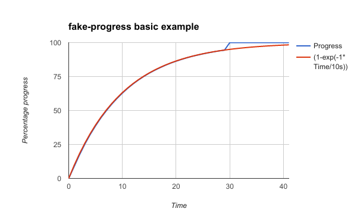
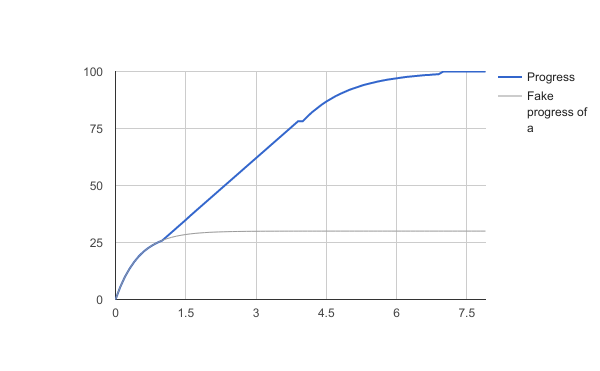

# Fakeprogress

Simulate smooth progression easily and combine real progression and fake progression.

## Basic example

```
var FakeProgress = require("..");

// Create the fake progress with a timeConstant of 10 seconds
// it means that :
//  after 10 seconds, progress will be 0.6321 ( = 1-Math.exp(-1) )
//  after 20 seconds, progress will be 0.8646 ( = 1-Math.exp(-2) )
//  and so one
var p = new FakeProgress({
  timeConstant : 10000,
  autoStart : true
});

var exampleAsyncFunction = function(callback){
  setTimeout(function(){
    callback()
  },30000)
};

var onEachSecond = function(){
  console.log("Progress is "+(p.progress*100).toFixed(1)+" %");
};

var interval = setInterval(onEachSecond, 1000);

var onEnd = function(){
  p.end();
  clearInterval(interval);
  console.log("Ended. Progress is "+(p.progress*100).toFixed(1)+" %")
};

exampleAsyncFunction(onEnd);
```

will print

```
Progress is 8.6 %
Progress is 17.3 %
Progress is 25.2 %
Progress is 32.3 %
...
```

The chart of progression over time.



Until the end is triggered, the progression is following the exponential curve, once "end" is triggered, progression goes to 100%.

## More complex

In this example we will mix 3 functions, A and C are classical async functions, B is an async function with a 'real' callback.


### Create 2 async function a, c

a and c are 2 basic async functions without progress.
```
var a = function(cb){
	setTimeout(function(){
		cb()
	},1000)
};

var c = function(cb){
	setTimeout(function(){
		cb()
	},3000)
};
```

### Create a class for event emitter with linear progress

b will be an instance of an event emmiter that has a progress event

```
const B = function(){
	EventEmitter.call(this);

	var count = 0;
	var self = this;
	var totalCount = 30;
	self.emit('start', count/totalCount);
	self._intervalId = setInterval(function(){
		count ++;
		if(count >= totalCount){
			self.emit('end', count/totalCount);
			clearInterval(self._intervalId);
		} else {
			self.emit('progress', count/totalCount);
		}
	}, 100)
};

util.inherits(B, EventEmitter);
```

### Create a fake progress and log his value over time

```
var p = new FakeProgress({});

var onEachDeciSecond = function(){
  console.log("Progress is "+(p.progress*100).toFixed(1)+" %");
};
onEachDeciSecond()

var interval = setInterval(onEachDeciSecond, 100);
```

### Create sub progress bar of p, for a progress

A has no progress so we fake his progress.
A succeed in 1000 ms, so we can consider 500 ms is a good timeConstant.

```
var aProgress = p.createSubProgress({
	timeConstant : 500,
	end : 0.3,
	autoStart : true
});
```


### Create a fake progress and log his value over time

```
var p = new FakeProgress({});

var onEachDeciSecond = function(){
  console.log("Progress is "+(p.progress*100).toFixed(1)+" %");
};
onEachDeciSecond()

var interval = setInterval(onEachDeciSecond, 100);
```

### Call everything

After each call, stop previous sub, and create a new subProgress for next request.

```
a(function(){
	aProgress.stop();
	var bProgress = p.createSubProgress({
		end : 0.8
	});
	var b = new B();

	b.on('progress', function(progress){
		bProgress.setProgress(progress);
	});

	b.on('end', function(){
		bProgress.stop();
		var cProgress = p.createSubProgress({
			timeConstant : 1000,
			autoStart : true
		});
		c(function(){
			cProgress.end()
      onEachDeciSecond()
      clearInterval(interval);
		})
	});
});
```

### All together

see [./test/complexExample.js]

### Results



## Documentation

See inside the code, documentated using JSDoc
